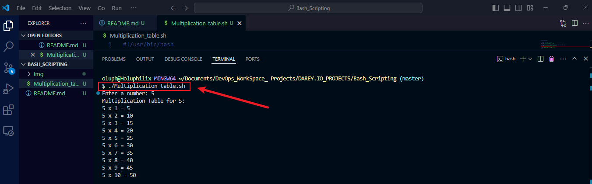
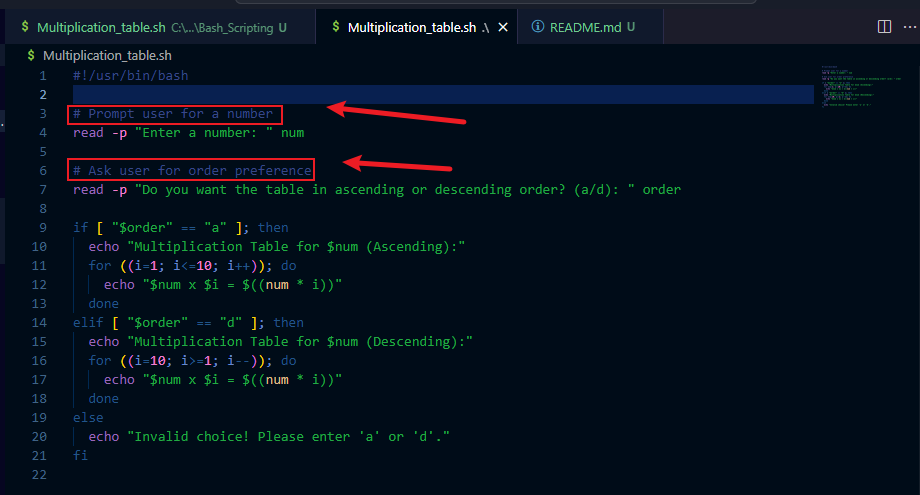
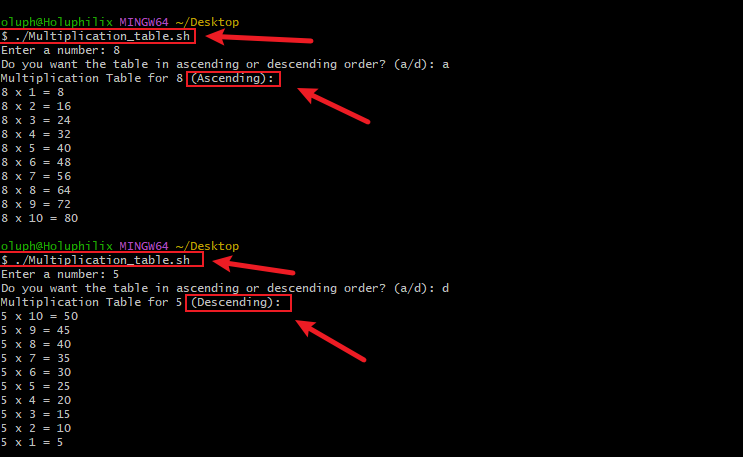
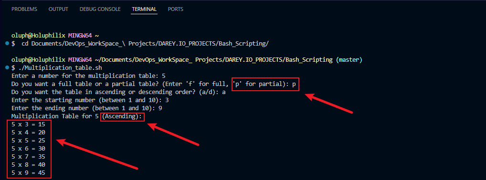
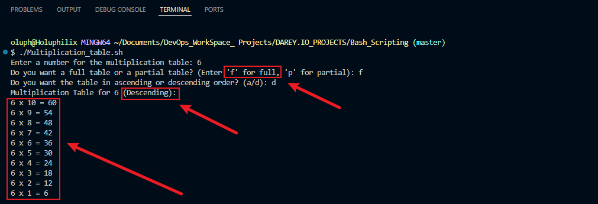
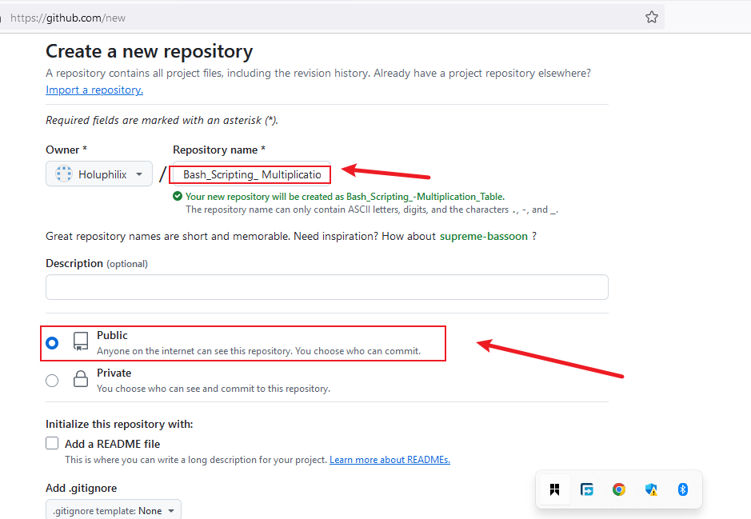
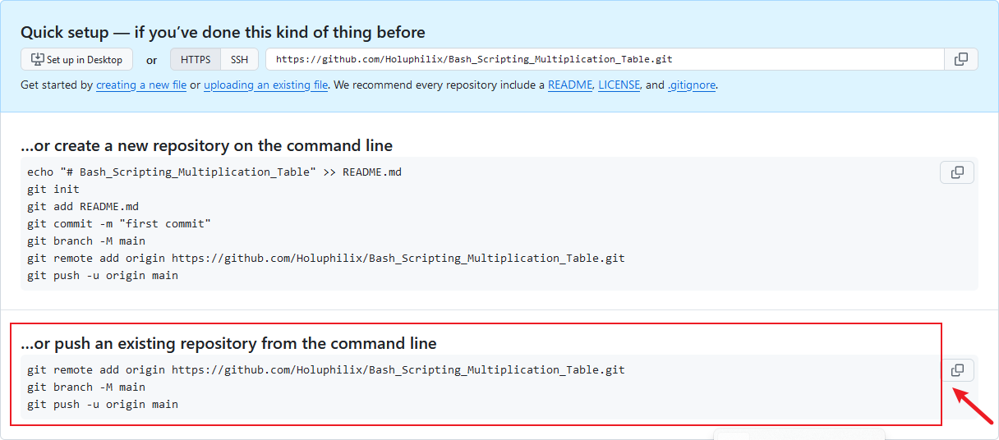

# Capstone Project - Linux Shell Scripting

## Bash Scripting Project: Multiplication Table

This project involves creating a Bash script to generate a multiplication table based on a number provided by the user. The project emphasizes using loops, handling user input, and applying conditional logic in Bash scripting.

### Project Description

**1. User Prompt:** The script prompts the user to: Enter a number for which they want to generate a multiplication table.  

Choose whether they would like to see: A full multiplication table (from 1 to 10) or a partial table within a specified range.

**2. Dynamic Output:** Based on the user's choice, the script dynamically generates and displays the corresponding multiplication table.

### Project Requirements and Objectives

- **User Input for Number:** Users can input the number for which the multiplication table will be generated.

- **Choice of Table Range:** Option to generate a full multiplication table (1 to 10) and option to generate a partial table by specifying the start and end of the range.

- **Implementation of Loops:** Uses both list-style loops and C-style loops and provides a comparison of syntax and clarity between the two loop styles.

- **Conditional Logic:** If-else statements handle logic based on user choices, such as generating a full or partial table.

- **Input Validation:** Ensures valid numbers are entered for the table and range. Defaults to the full multiplication table if invalid inputs are detected and provides feedback for invalid inputs.

- **Readable Output:** Outputs are formatted to be clear and user-friendly and allows users to choose between ascending or descending order for the table.

- **Well-Commented Code:** Includes comments explaining key sections and logic for better readability and understanding.

### Task 1: Implement Version Control with Git

#### Step 1.1: Initialize Git Repository

To begin, create the project directory named __Bash_Scripting__, navigate into it, and initialize it as a Git repository.

__Commands:__
```bash
mkdir Bash_Scripting
cd Bash_Scripting
git init
```

__Note:__ For this project, I am using **Visual Studio Code** on a Windows workstation to execute these script commands. Visual Studio Code (VS Code) is a lightweight, versatile, and user-friendly code editor that provides powerful features such as syntax highlighting, intelligent code suggestions, an integrated terminal, and debugging tools. These features streamline the scripting process, enhance productivity, and allow seamless testing and execution within the same environment.

### Task 2 : Using List Form For Loop

- **Prompt the User:**  First, your script should ask the user to input a number. Use the __read__ command to capture this input into a variable.

- **Generate Multiplication Table:** Use a list form for loop to iterate through the numbers 1 to 10. In each iteration,calculate the product of the user's number and the iterator variable, then print the result in a clear format.


- For input 5, the output will look like this:



### Task 3 : Using C-style For Loop 

- **Repeat the Prompt:** You don't need to ask the user again if you're making this a single script. Just proceed with the C-style loop using the same variable.

- **Generate Multiplication Table with C-style Loop:** Now, write a C-style for loop to achieve the same task as in Part 1. Compare how this approach differs from the list form loop in terms of syntax and clarity.

**Note:** This part uses the C-style for loop to achieve the same result. Additionally, users can choose to display the table in ascending or descending order.



- For input 8 and 5, the output will look like this: 



- Key differences between C-style loops and list-form loops in Bash

| Feature           | C-Style Loop                           | List-Form Loop                         |
|-------------------|----------------------------------------|----------------------------------------|
| **Syntax**        | `for ((initialization; condition; increment))` | `for var in list`                     |
| **Iteration Type**| Iterates over numerical values with custom initialization, condition, and increment. | Iterates over a predefined list of values (numbers, strings, or array elements). |
| **Use Case**      | Best for numerical ranges or complex control over iteration steps. | Ideal for fixed sets of values or sequences. |
| **Flexibility**   | More flexible for non-linear increments or decrementing. | Simpler but less suitable for non-standard ranges. |
| **External Commands** | No external commands needed, works directly in Bash. | Often relies on external commands like `seq` for generating ranges. |
| **Performance**   | Slightly faster for numerical iterations. | May involve external processes, making it marginally slower. |
| **Readability**   | Less readable for simple iterations, as it requires explicit initialization and increment. | More readable and concise for straightforward lists or ranges. |


### Task 4:  Interactive Multiplication Table Generator Using Bash Scripting


This project is designed to be a practical application of Bash scripting fundamentals, focusing on loops, conditional logic, and user interaction. By completing this task, you'll gain valuable experience in automating tasks and improving your scripting proficiency.


1. Prompt the user to enter a number for the multiplication table.
   
2. Ask if they want a full table or a partial table.
- If partial, prompt for the start and end numbers of the range.

3. Validate the range inputs and handle invalid or out-of-bound entries.

4. Generate and display the multiplication table according to the specified range.

5. Provide clear output formatting for ease of reading.

6. Enhanced User Interaction: Incorporate additional checks or features, like repeating the program for another number without restarting the script.

7. Ask the user if they want to see the table in ascending or descending order combined with your loop of choice. 

__Commands:__
```bash
#!/usr/bin/bash

# Prompt the user for a number
read -p "Enter a number for the multiplication table: " num

# Ask the user if they want a full or partial table
read -p "Do you want a full table or a partial table? (Enter 'f' for full, 'p' for partial): " choice

# Function to display the multiplication table in ascending or descending order
display_table() {
  local start=$1
  local end=$2
  local step=$3
  local order_text=$4

  echo "Multiplication Table for $num ($order_text):"
  for ((i=start; i!=end+step; i+=step)); do
    echo "$num x $i = $((num * i))"
  done
}

# Ask user for order preference
read -p "Do you want the table in ascending or descending order? (a/d): " order

if [ "$choice" == "f" ]; then
  # Full multiplication table
  if [ "$order" == "a" ]; then
    display_table 1 10 1 "Ascending"
  elif [ "$order" == "d" ]; then
    display_table 10 1 -1 "Descending"
  else
    echo "Invalid choice! Please enter 'a' or 'd'."
  fi
elif [ "$choice" == "p" ]; then
  # Partial multiplication table
  read -p "Enter the starting number (between 1 and 10): " start
  read -p "Enter the ending number (between 1 and 10): " end

  # Validate the input range
  if ((start >= 1 && start <= 10 && end >= 1 && end <= 10)); then
    if [ "$order" == "a" ]; then
      if ((start <= end)); then
        display_table "$start" "$end" 1 "Ascending"
      else
        echo "Invalid range! Start should be less than or equal to End for ascending order."
      fi
    elif [ "$order" == "d" ]; then
      if ((start >= end)); then
        display_table "$start" "$end" -1 "Descending"
      else
        echo "Invalid range! Start should be greater than or equal to End for descending order."
      fi
    else
      echo "Invalid choice! Please enter 'a' or 'd'."
    fi
  else
    echo "Invalid range! Ensure both numbers are between 1 and 10."
  fi
else
  echo "Invalid choice! Please enter 'f' or 'p'."
fi
```
- Output for Partial Multiplication table (Ascending)



- Output for Full Multiplication table (Descending)



### 1.4 Stage and Commit the Template to Git

In this step, I will add the website files to the Git repository, configure my global Git settings, and make an initial commit with a descriptive message.

- Add Files: Add all website files to the staging area.

- Configure Git User Information: Set up global configuration with my actual git username and email address.

- Commit Changes: Commit the changes with a clear and descriptive message.

### Task 1.5 Push the code to your Github repository

After initializing your Git repository and adding your Bash Scripting Multiplication table, the next step is to push your code to a remote repository on GitHub. This step is crucial for version control and collaboration.

- Create a Remote Repository on GitHub: Log into your GitHub account and create a new repository named Bash_Scripting_Multiplication_Table. Leave the repository empty without initializing it with a README, .gitignore, or license.






- Link Your Local Repository to GitHub: In your terminal, within your project directory, add the remote repository URL to your local repository configuration.

- Push Your Code: Upload Your Local Repository Content to GitHub Once you have linked your local repository to GitHub, use the following command to push your commits from your local main branch to the remote repository. This enables you to store your project in the cloud and share it with others.

__Commands:__
```bash
git remote add origin https://github.com/Holuphilix/Bash_Scripting_Multiplication_Table.git
git branch -M main
git push -u origin main
```
